# Arquitectura de GPS

Mapa de las piezas actuales y de sus fronteras. La [spec de diseño](superpowers/specs/2026-08-24-arquitectura-y-walking-skeleton-design.md) explica las decisiones originales. Los [cambios archivados](../openspec/changes/archive/) registran las decisiones posteriores. Este documento distingue lo existente de lo futuro.

## 1. Vista general

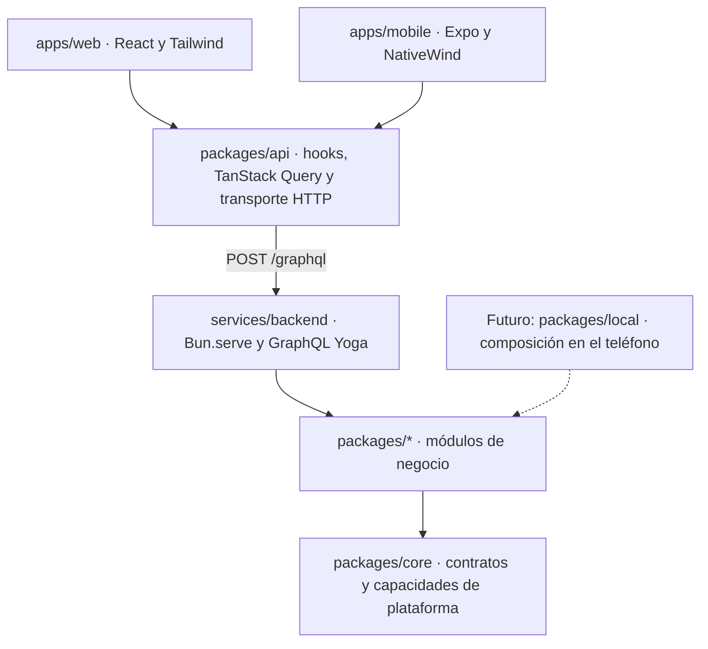

Web y mobile comparten las reglas puras de `/dominio` y los documentos de API, no los componentes de interfaz. Hoy `packages/api` sólo implementa `transporteHttp`. No existe `packages/local`, transporte local ni base en el teléfono.

## 2. Adentro del backend

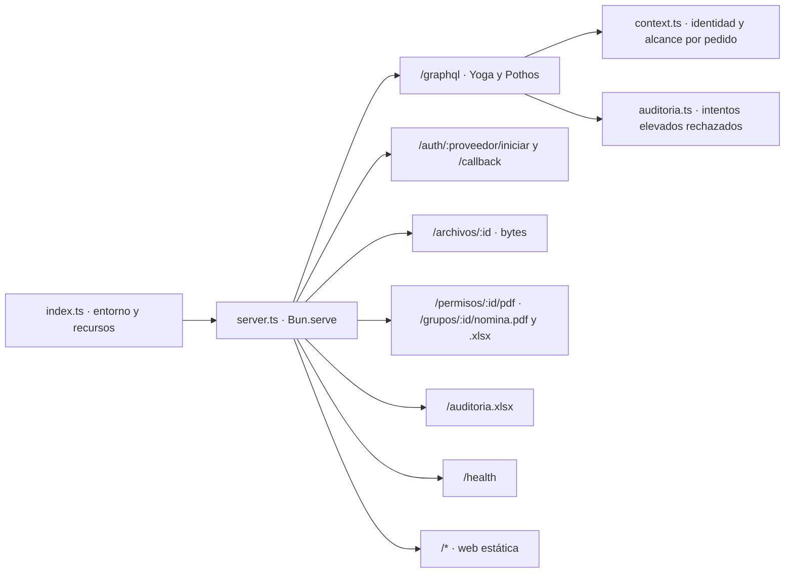

Un proceso sirve web y API en un puerto, también en desarrollo. Los archivos y las exportaciones viajan por HTTP, no por GraphQL. El interceptor no registra las escrituras exitosas. Cada caso de uso registra su propio evento en la transacción. No hay rate limiting ni caché de respuestas en envelop.

## 3. Arranque: la raíz de composición

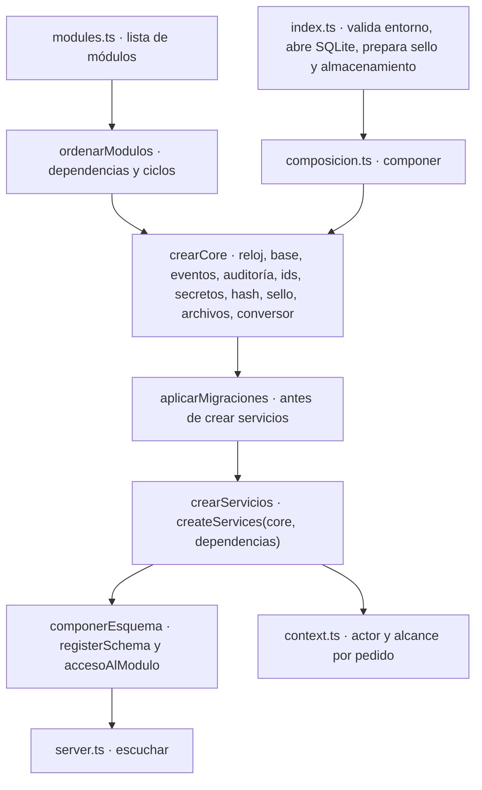

Las dependencias de `Module<S, D>` se tipan contra las claves de `D` y llegan como servicios ya construidos. El registro comprueba dependencias y ciclos al arrancar. `schema.gql` se genera con `bun run schema` y se verifica en CI. No se escribe durante cada arranque. La composición registra en Archivos los autorizadores de los módulos dueños de recursos.

`@gps/core` tiene tres puertas: el índice para plomería del servidor, `@gps/core/graphql` para Pothos y `@gps/core/fechas` para código isomorfo. Un import de valor desde el índice arrastraría dependencias de servidor al bundle mobile.

## 4. Anatomía de un módulo

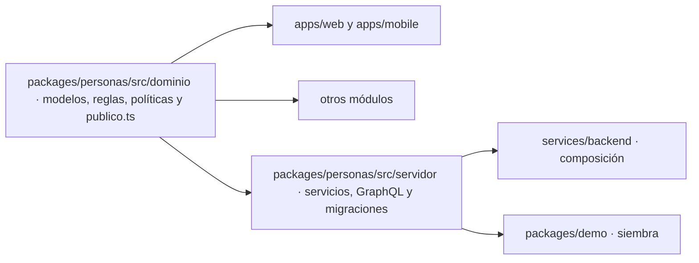

`/dominio` es puro e isomorfo. Una decisión que sólo necesita datos recibidos por parámetro vive allí, aunque hoy la invoque sólo el servidor. `publico.ts` expone a otros módulos una interfaz menor que el servicio completo. `/servidor` organiza efectos, persistencia y esquema. `servicio.ts` declara el contrato y compone los casos de uso.

Estructura y Archivos mantienen operaciones cortas en `servicio.ts`. Afiliación y Salidas separan casos de uso cohesivos. No hay una capa de repositorio obligatoria ni un archivo por método. Los enums compartidos de GraphQL usan `enumCompartido` en `@gps/core/graphql`. Así Estructura y Personas registran `Rama` una vez sin mover su catálogo a Core.

El linter prohíbe importar `*/servidor` desde las apps y desde otro módulo. `packages/demo` está exceptuado para la siembra. `@gps/core` no es un módulo de negocio. Los módulos reciben servicios ajenos por `createServices` o por el contexto de los resolvers.

Todo `src/` de un módulo evita `bun:*`, `node:*` y lecturas de archivos. En `/servidor`, el reloj y los ids provienen de `Core`, nunca de la plataforma. Las migraciones importan SQL como texto con una extensión de Bun. Esa carga necesita adaptación para Metro antes de ejecutar módulos en el teléfono. Para crear un módulo, ver [crear un módulo](crear-un-modulo.md).

## 5. Recorrido de una consulta

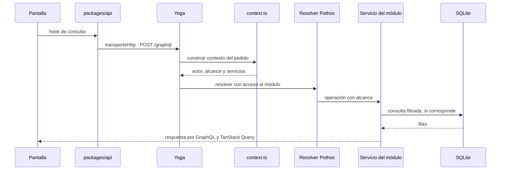

`packages/api` usa documentos tipados y TanStack Query. Su caché persistida se particiona por persona. Web usa IndexedDB y mobile usa AsyncStorage para los datos. La sesión mobile se guarda aparte en `expo-secure-store`. La consulta pública de versión de Sistema no necesita base ni sesión. No todas las consultas pasan por un repositorio.

## 6. Autenticación, alcance y reglas de negocio

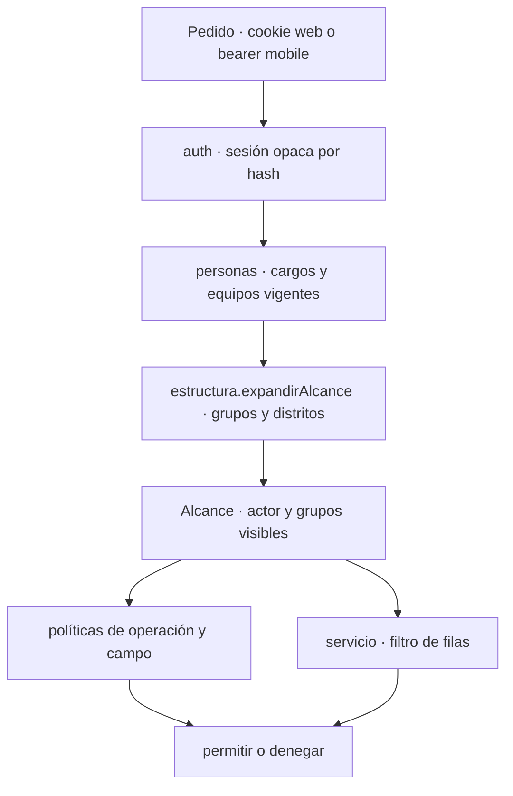

Google y Apple usan Authorization Code con PKCE, `state`, `nonce` y validación JOSE. Demo ofrece un proveedor interno sólo en ese entorno. La identidad interna es una `Persona`, sin tabla de usuarios ni correlación por correo. Las sesiones duran 30 días, son revocables y no contienen roles. Cada pedido reconstruye las funciones vigentes.

La cookie web es `HttpOnly`. Mobile manda un bearer desde almacenamiento seguro. Invitaciones y recuperaciones usan enlaces de un solo uso, con vencimiento de siete días. Recuperar reemplaza la identidad perdida y revoca las sesiones.

Hay una persona administradora designada. Su sesión ordinaria no tiene alcance global. Debe reautenticarse con una identidad vinculada para elevarse durante diez minutos. La CLI permite reasignarla si pierde sus identidades. No existe mutation equivalente.

La autorización tiene tres capas. `accesoAlModulo` es obligatorio y cerrado por omisión en cada campo raíz. `Alcance` es el primer parámetro de operaciones iniciadas por usuarios. Las políticas puras deciden por operación o campo. La pantalla puede usarlas para ocultar acciones, pero el servidor siempre las aplica. Las operaciones internas como el barrido de Afiliación no reciben un alcance falso.

Un campo GraphQL que devuelve `null` al denegarse debe ser nullable. Las escrituras denegadas lanzan error. El directorio de distritos y grupos es visible para cualquier persona con sesión, pero sus datos internos requieren autorización. Un comisionado alcanza los permisos que firma en su distrito sin acceder al padrón ni a la cuenta corriente de cada grupo.

Personas guarda pertenencias, cargos y equipos con vigencia y revocación. Estructura expande sus ámbitos. Una persona pertenece a una unidad concreta, cuya rama deriva del catálogo. Un grupo puede tener varias unidades de una misma rama. `Persona` no guarda sexo.

El detalle de persona lee `personas(grupoId)` y permite corregir datos, incluido el documento. También permite cambiar a un dirigente de unidad con historial. Los pases de beneficiarios se hacen por lote. No existe una consulta global `persona(id)`.

## 7. Dependencias entre módulos

Las flechas indican «depende de». `core` aporta contratos y capacidades a todos, pero no es un módulo de negocio.

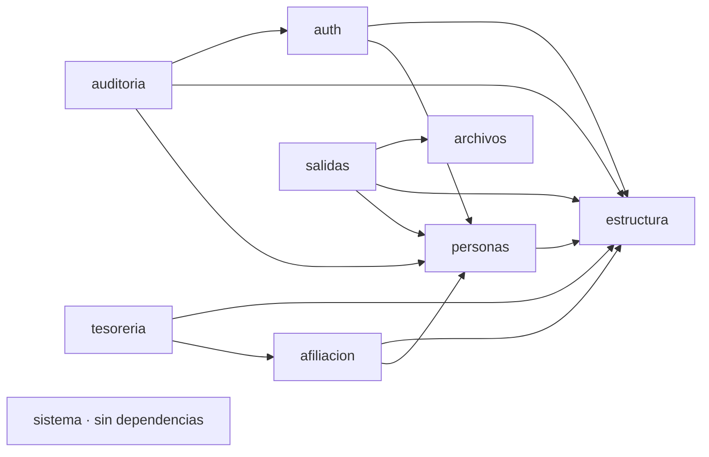

Estructura, Archivos y Sistema no dependen de otros módulos. La pertenencia y los cargos viven en Personas. Por eso Personas depende de Estructura y no al revés. Afiliación consulta grupos abiertos y miembros activos para conservar fotografías de las declaraciones. Tesorería consume las declaraciones y lista también grupos cerrados. Cerrar un grupo no elimina su deuda.

Salidas usa Personas para participantes y firmantes, Estructura para unidades y distrito, y Archivos para PDF, escaneos y adjuntos. Archivos no importa Salidas. La raíz de composición registra el autorizador del recurso. Si no hay dueño registrado, no entrega el archivo.

Auditoría lee nombres desde Personas y Estructura. Depende de Auth para migrar el historial de seguridad. Las escrituras de los otros módulos usan `core.auditoria`, no una dependencia hacia el módulo Auditoría.

## 8. Demo, persistencia y portabilidad

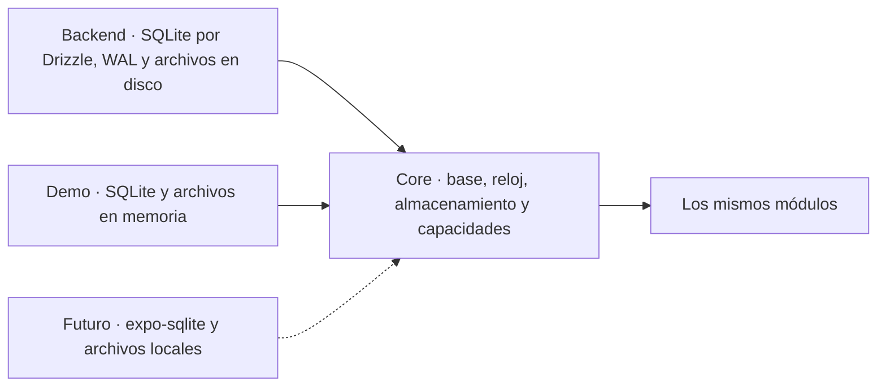

`bun run demo` siembra datos sintéticos por los servicios y ofrece perfiles de acceso. El backend abre SQLite en `bd.ts` y espera hasta cinco segundos ante un lock. El bus, el reloj, los ids, los secretos, el hash, el sellador HMAC, el almacenamiento y la conversión HEIC a JPEG entran por `Core`.

Ni las claves de sello ni la ruta de la base ni el directorio de archivos se exponen como configuración de los módulos. Fuera de demo, los archivos van a disco. En demo, van a memoria. El runner de migraciones recibe SQL y usa `core.bd`.

Los imports `with { type: 'text' }` de los módulos dependen de Bun. Requieren una solución para Metro cuando exista `packages/local`. No hay base offline ni sincronización. La caché mobile no equivale a ejecutar los módulos localmente.

## 9. Eventos entre módulos y cuentas corrientes

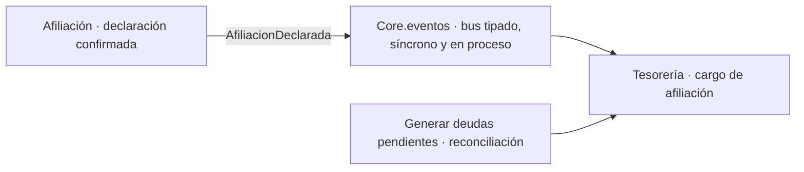

Afiliación publica después del commit. Si falla el suscriptor o falta la cuota, la declaración queda guardada. La reconciliación manual crea el cargo pendiente de forma idempotente. No hay broker ni reintentos automáticos.

Tesorería guarda cuotas por período y movimientos inmutables: cargo positivo, pago negativo y anulación de pago positiva. Un saldo positivo es deuda. Uno negativo es saldo a favor. El cargo conserva cantidad y cuota aplicadas, aunque cambien después los datos de referencia. No hay imputación de pagos a cargos ni saldo mutable.

## 10. Salidas, archivos y auditoría

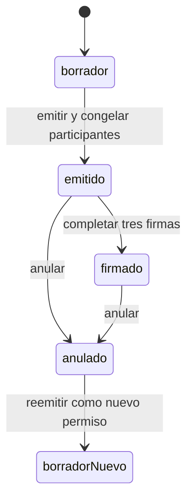

Emitir guarda una fotografía de participantes y un PDF inicial en Archivos. El permiso guarda `hashDelPdf`, que ancla las firmas, y `hashDelContenido`, que identifica el texto canónico impreso en cada hoja. El expediente tiene numeración diocesana consecutiva por año y unicidad en la base. Una falla al generar el PDF puede dejar un hueco, pero no duplica un número.

Editar un permiso emitido exige anular y reemitir. El PDF descargable compone las firmas de la app y agrega los escaneos como anexos. Las tres firmas requeridas corresponden a jefe de grupo, director y comisionado de distrito. La app exige que firme la persona que ocupa el cargo en ese ámbito, incluso si hay elevación administrativa.

Los trazos se sellan con HMAC y la clave identificada en la firma. `hashDelPdf` solo no probaría autoría. La firma en papel guarda el escaneo y la declaración de cargos, pero no verifica el papel. No hay firma con certificado ni re-sellado para retirar claves.

Archivos guarda metadatos en SQLite y bytes fuera de la base. La subida solicita y confirma por GraphQL y transfiere bytes por HTTP. La descarga consulta el autorizador del módulo dueño. Salidas genera PDF en `/servidor`, para no introducir `pdf-lib` en el bundle de mobile.

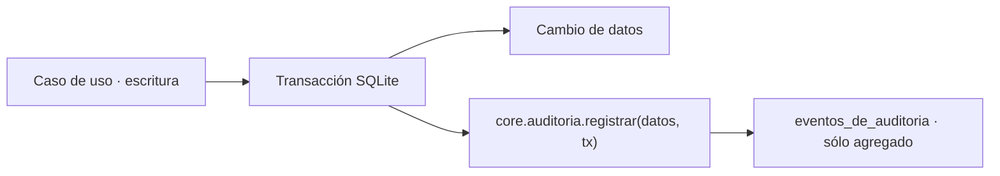

Cada escritura registra un evento en la misma transacción. Una edición guarda `cambios` anterior/nuevo. Altas, firmas y anulaciones guardan un resumen reducido. No se guardan secretos, URLs privadas, bytes ni trazos. Las reacciones internas indican `origenInterno`. Los intentos sensibles rechazados se registran aparte para sobrevivir al rechazo.

El interceptor GraphQL sólo observa la intención elevada rechazada, sin conceder permisos. `ACCIONES_AUDITADAS` en `services/backend/src/auditoria.ts` inventaría las mutations. Su test exige clasificar las nuevas.

La consulta de Auditoría pagina por cursor y combina filtros de fechas, grupo, actor, módulo y acción. Jefatura y Secretaría leen eventos de sus grupos. Sólo la persona administradora elevada lee toda la diócesis y eventos sin grupo. `/auditoria.xlsx` exporta con la misma autorización. El historial anterior de autoridad y seguridad se migró al registro central. Sus tablas originales permanecen para rollback, sin escritores nuevos.
